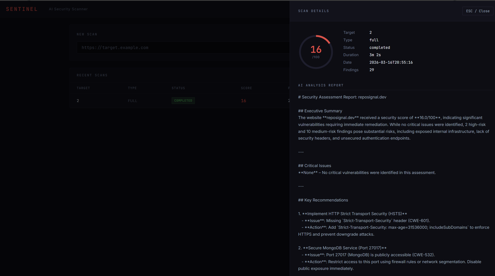

# Sentinel — AI Security Scanner

[](https://github.com/timmeck/sentinel/actions/workflows/ci.yml)
[](https://www.python.org/downloads/)
[](LICENSE)

```
 ███████╗███████╗███╗   ██╗████████╗██╗███╗   ██╗███████╗██╗
 ██╔════╝██╔════╝████╗  ██║╚══██╔══╝██║████╗  ██║██╔════╝██║
 ███████╗█████╗  ██╔██╗ ██║   ██║   ██║██╔██╗ ██║█████╗  ██║
 ╚════██║██╔══╝  ██║╚██╗██║   ██║   ██║██║╚██╗██║██╔══╝  ██║
 ███████║███████╗██║ ╚████║   ██║   ██║██║ ╚████║███████╗███████╗
 ╚══════╝╚══════╝╚═╝  ╚═══╝   ╚═╝   ╚═╝╚═╝  ╚═══╝╚══════╝╚══════╝
 AI Security Scanner
```

Self-hosted security scanner with AI-powered analysis. Scans web apps for vulnerabilities — headers, SSL, ports, cookies, SQL injection, XSS, CORS, directory traversal, rate limiting, DNS, and more. Generates actionable reports with severity ratings and fix recommendations. All local with Ollama.

**Pure Python + SQLite. 49 tests. No API keys required.**



## Features

| Feature | Description |
|---|---|
| **16 Security Checks** | Headers, SSL, Ports, Cookies, Paths, Technology, HTTPS Redirect, SQLi, XSS, Open Redirect, Directory Traversal, Rate Limiting, CORS, DNS/Subdomains, API, Crawler |
| **Vulnerability Testing** | Active probing for SQLi, XSS, open redirect, directory traversal |
| **AI Reports** | LLM-generated analysis with fix recommendations |
| **Scan Profiles** | quick (5 checks), standard (10), full (16), api-only |
| **Severity Scoring** | 0-100 score with critical/high/medium/low/info ratings |
| **Scan Diff** | Compare scans to track security changes over time |
| **Scheduled Scans** | Cron-like intervals for continuous monitoring |
| **Report Export** | JSON, CSV, Markdown export |
| **Web Crawler** | Discover linked pages and scan them too |
| **Subdomain Enum** | DNS lookup on common subdomains |
| **Dual LLM** | Ollama (free) or Anthropic Claude |
| **Web Dashboard** | Real-time scan progress, findings browser, target management |
| **CLI** | Scan, list, show, diff, export from command line |
| **Auth** | Optional API key protection |
| **Docker** | One-command deployment |
| **CI** | GitHub Actions for Python 3.11-3.13 |

## Quick Start

```bash
git clone https://github.com/timmeck/sentinel.git
cd sentinel
pip install -r requirements.txt

# Make sure Ollama is running
ollama pull qwen3:14b

# Scan a target (your own site only!)
python run.py scan https://your-site.com

# Quick scan (headers + SSL + cookies only)
python run.py scan https://your-site.com --profile quick

# Full scan (all 16 checks)
python run.py scan https://your-site.com --profile full

# List past scans
python run.py scans

# Show scan details
python run.py show 1

# Compare two scans
python run.py diff 1 2

# Export report
python run.py export 1 --format markdown

# Start dashboard
python run.py serve
# -> http://localhost:8500
```

## Security Checks

| Check | Type | What it does |
|---|---|---|
| **Headers** | Passive | Checks security headers (CSP, HSTS, X-Frame-Options, etc.) |
| **SSL/TLS** | Passive | Certificate validity, expiry, protocol version |
| **Ports** | Active | Scans common ports (80, 443, 8080, 3306, 5432, etc.) |
| **Cookies** | Passive | Checks Secure, HttpOnly, SameSite flags |
| **Paths** | Active | Probes for exposed paths (/admin, /.env, /.git, etc.) |
| **Technology** | Passive | Detects server software, frameworks, versions |
| **HTTPS Redirect** | Passive | Verifies HTTP -> HTTPS redirect |
| **SQL Injection** | Active | Probes query params with SQLi payloads |
| **XSS** | Active | Probes inputs with XSS payloads |
| **Open Redirect** | Active | Tests for unvalidated redirects |
| **Directory Traversal** | Active | Tests for path traversal vulnerabilities |
| **Rate Limiting** | Active | Checks if rate limiting is configured |
| **CORS** | Active | Tests for CORS misconfigurations |
| **DNS/Subdomains** | Active | Enumerates subdomains via DNS |
| **API** | Active | Checks for exposed API endpoints |
| **Crawler** | Active | Discovers and maps linked pages |

## Architecture

```
src/
├── config.py              # Configuration
├── db/
│   └── database.py        # SQLite (targets, scans, findings)
├── scanner/
│   ├── engine.py          # Scan orchestrator with profiles
│   ├── checks.py          # Core checks (headers, SSL, ports, cookies, paths, tech, HTTPS)
│   ├── vulns.py           # Vulnerability checks (SQLi, XSS, redirect, traversal, rate limit, CORS)
│   ├── dns_checks.py      # DNS and subdomain enumeration
│   ├── api_checks.py      # API endpoint discovery
│   ├── crawler.py         # Web crawler
│   ├── diff.py            # Scan comparison
│   ├── export.py          # Report export (JSON, CSV, Markdown)
│   └── scheduler.py       # Scheduled scans
├── ai/
│   └── llm.py             # Ollama + Anthropic with retry
├── web/
│   ├── api.py             # FastAPI + SSE
│   └── auth.py            # Auth middleware
└── utils/
    └── logger.py
```

## API Endpoints

| Method | Endpoint | Description |
|---|---|---|
| GET | `/api/status` | System status |
| POST | `/api/scan` | Start a scan |
| GET | `/api/scans` | List scans |
| GET | `/api/scans/{id}` | Scan details + findings |
| DELETE | `/api/scans/{id}` | Delete scan |
| GET | `/api/targets` | List targets |
| GET | `/api/findings` | Browse findings |
| GET | `/api/diff/{id1}/{id2}` | Compare two scans |
| POST | `/api/export/{id}` | Export report |
| GET | `/api/activity` | Activity log |
| GET | `/api/events/stream` | SSE live events |
| GET | `/` | Web dashboard |

## Important

**Only scan targets you own or have explicit permission to test.** Unauthorized scanning is illegal in most jurisdictions. Sentinel is designed for:
- Scanning your own websites and APIs
- Authorized penetration testing engagements
- Security research on test environments
- CTF competitions

## Configuration

```env
OLLAMA_URL=http://localhost:11434
OLLAMA_MODEL=qwen3:14b
SENTINEL_PORT=8500
# SENTINEL_API_KEY=secret
SCAN_TIMEOUT=30
```

## Nexus Protocol

Sentinel integrates with [Nexus](https://github.com/timmeck/nexus) via the NexusAdapter SDK.

| Capability | Description | Price |
|-----------|-------------|-------|
| `security_analysis` | Run security scan on a URL | 0.02 |
| `threat_detection` | Quick threat detection check | 0.02 |

**Features**: HMAC signature verification, automatic heartbeats (30s), auto-registration with Nexus on startup.

## Testing

```bash
pip install pytest pytest-asyncio
pytest tests/ -v
# 49 passed
```

## Docker

```bash
docker compose up -d
```

## Support

[](https://github.com/timmeck/sentinel)
[](https://paypal.me/tmeck86)

---

Built by [Tim Mecklenburg](https://github.com/timmeck)
